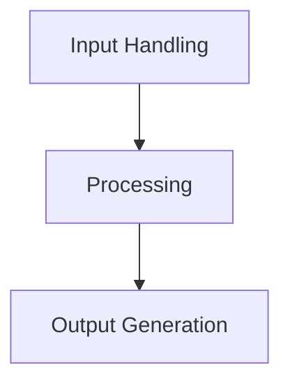
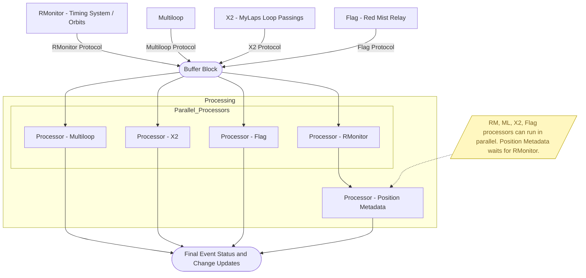

# Dataflow for EventStatus Processors
This document outlines the dataflow for the EventStatus processors within the RedMist Timing and Scoring Service. The EventStatus processors are responsible for managing and updating the status of events based on various inputs and conditions.

## Overview
The dataflow for the EventStatus processors can be broken down into several key stages:

1. **Input Handling**: The processors receive input data from various sources, including timing systems, that come in over a stream with a type tag identifying the data type.

2. **Processing**: The processors apply business logic to the input data to determine the current status of each event. This may involve calculations, comparisons, and state updates.

3. **Output Generation**: The processors generate output data that reflects the updated status of each event and changes to status as data is processed. This output may be used to update the user interface, trigger notifications, or persist changes to a database.

## Dataflow Diagram

## Detailed Workflow
1. **Input Handling**
   - Messages coming in enter a BufferBlock. This is intended to distribute the message to one processor per type. If there are multiple processors in the future, this will need to change.

2. **Processing**
   - The baseline data source is RMonitor. Processing is done here first.
   - Subsequent processors are applied on top of the RMonitor data.

    ### Types of processors
    - RMonitor - RMonitor protocol from a timing system such as Orbits
    - Multiloop - Multiloop protocol
    - X2 - loop passings from MyLaps X2 system
    - Flag - Flag status changes from Red Mist relay
    - Position Metadata - Calculations based on position

     Note: The RMonitor, Multiloop, X2 and Flags processors can run in parallel. The PositionMetadata must happen after RMonitor runs as it is RMonitor that handles the base car positions.
 
3. **Output Generation**
   - The processors generate output data based on the final state.
   - Output data is sent to the appropriate channels (e.g., UI updates).
