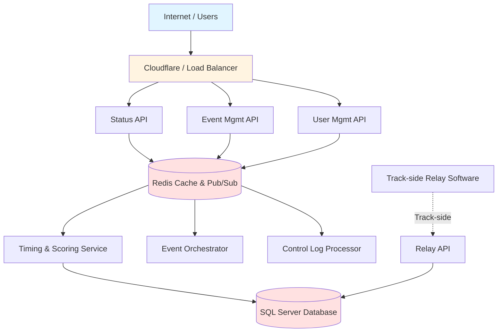
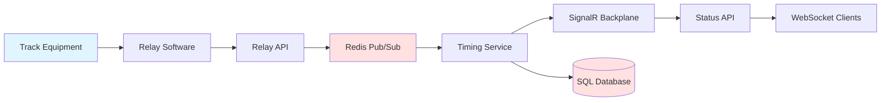
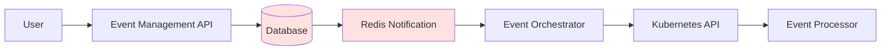

# Architecture Overview

RedMist Timing & Scoring is a cloud-native, microservices-based platform for real-time race timing and scoring.

## System Architecture



## Core Services

### Public-Facing APIs

#### Status API
**Purpose:** Real-time event status and timing data  
**Technology:** ASP.NET Core 9, SignalR, Redis  
**Endpoints:** `/Events`, `/Organization`  
**Features:**
- Live event listings
- Real-time WebSocket updates
- Session results
- Car lap data
- Control logs

#### Event Management API
**Purpose:** Event configuration and administration  
**Technology:** ASP.NET Core 9, Entity Framework  
**Endpoints:** `/Event`, `/Organization`  
**Features:**
- Event CRUD operations
- Organization settings
- Control log configuration
- Event activation

#### User Management API
**Purpose:** User and organization management  
**Technology:** ASP.NET Core 9, Keycloak  
**Endpoints:** `/Organization`  
**Features:**
- Organization provisioning
- User-organization mappings
- Relay client creation
- Keycloak integration

### Internal Services

#### Timing & Scoring Service
**Purpose:** Real-time event processing  
**Technology:** ASP.NET Core 9, MessagePack  
**Features:**
- RMonitor data processing
- Multiloop data processing
- X2 timing system integration
- Position calculations
- Lap time processing
- Flag state management

#### Event Orchestrator
**Purpose:** Event lifecycle management  
**Technology:** ASP.NET Core 9, Kubernetes  
**Features:**
- Event processor provisioning
- Container orchestration
- Service scaling
- Health monitoring

#### Control Log Processor
**Purpose:** Race control log processing  
**Technology:** ASP.NET Core 9  
**Features:**
- Control log fetching
- Penalty processing
- Driver notification
- Log enrichment

#### Event Logger
**Purpose:** Event data logging  
**Technology:** ASP.NET Core 9  
**Features:**
- Source data logging
- Debug information
- Performance metrics

### Relay API
**Purpose:** Track-side data ingestion  
**Technology:** ASP.NET Core 9, SignalR  
**Features:**
- Timing data reception
- Transponder data
- Session changes
- Flag updates
- Metadata sync

## Data Flow

### Real-Time Event Updates



### Event Management Flow



## Technology Stack

### Backend
- **.NET 9** - Primary framework
- **ASP.NET Core** - Web APIs
- **Entity Framework Core** - ORM
- **SignalR** - Real-time communication
- **Redis** - Caching and pub/sub
- **MessagePack** - Binary serialization
- **NLog** - Logging

### Data Storage
- **SQL Server** - Primary database
- **Redis** - Cache and message broker
- **Hybrid Cache** - L1/L2 caching

### Infrastructure
- **Kubernetes** - Container orchestration
- **Docker** - Containerization
- **Cloudflare** - CDN and DDoS protection
- **Prometheus** - Metrics
- **Keycloak** - Authentication

### Client Libraries
- **@microsoft/signalr** - JavaScript/TypeScript
- **signalrcore** - Python
- **MessagePack** - Binary protocol

## Design Patterns

### Microservices
Each service has a single responsibility and can be scaled independently.

### Event-Driven Architecture
Services communicate via Redis pub/sub for loose coupling.

### CQRS (Command Query Responsibility Segregation)
- **Commands:** Event Management API
- **Queries:** Status API

### Circuit Breaker
Resilient communication between services with exponential backoff.

### Repository Pattern
Data access abstraction with Entity Framework.

### Dependency Injection
Built-in .NET DI container for loose coupling.

## Scalability

### Horizontal Scaling
- **Status API:** Multiple instances behind load balancer
- **Timing Service:** One instance per event (event-based partitioning)
- **Event Management:** Stateless, can scale freely

### Caching Strategy
- **L1 Cache:** In-memory (per instance)
- **L2 Cache:** Redis (shared)
- **TTL:** 4 hours (configurable)

### Database
- **Read Replicas:** For query load distribution
- **Indexing:** Optimized for common queries
- **Partitioning:** By organization and event

## Security

### Authentication
- **OAuth 2.0** with Keycloak
- **JWT** tokens
- **Client credentials** flow for services
- **Authorization code** flow for users

### Authorization
- **Role-based** access control
- **Organization-scoped** data access
- **API-level** authorization

### Network Security
- **HTTPS** only (TLS 1.2+)
- **CORS** configured
- **Rate limiting** (planned)
- **DDoS protection** via Cloudflare

## Monitoring & Observability

### Health Checks
- `/healthz/startup` - Initial health
- `/healthz/live` - Liveness probe
- `/healthz/ready` - Readiness probe

### Metrics
- **Prometheus** metrics exposed
- **Custom gauges** for connections
- **Performance counters**

### Logging
- **Structured logging** with NLog
- **Centralized logs** (planned)
- **Log levels** configurable

## Deployment

### Kubernetes
```yaml
apiVersion: apps/v1
kind: Deployment
metadata:
  name: status-api
spec:
  replicas: 3
  selector:
    matchLabels:
      app: status-api
  template:
    spec:
      containers:
      - name: status-api
        image: redmist/status-api:latest
        ports:
        - containerPort: 8080
        env:
        - name: REDIS_SVC
          value: redis-service
        - name: ConnectionStrings__Default
          valueFrom:
            secretKeyRef:
              name: db-secret
              key: connection-string
```

### CI/CD
- **GitHub Actions** for build
- **Docker** images
- **Helm** charts for deployment

## Related Documentation

- [Getting Started](getting-started.md)
- [Deployment Guide](deployment.md)
- [Configuration](configuration.md)
- [Monitoring](monitoring.md)
